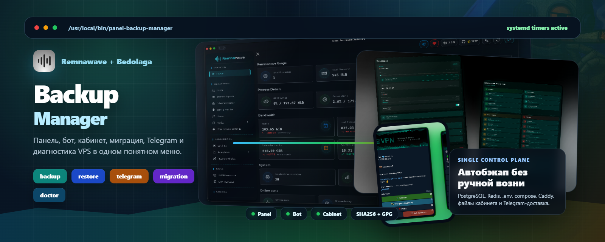

<p align="center">
  
</p>

<h1 align="center">Remnawave Panel Backup Manager</h1>

<p align="center">
  Интерактивный менеджер для Remnawave, Bedolaga и RemnaNode: backup, restore, миграция, Telegram, Caddy, диагностика сервера и обслуживание VPS в одном меню.
</p>

<p align="center">
  <a href="README.en.md">English</a> · <a href="README.md">Русский</a>
</p>

<p align="center">
  
  
  
  
  
</p>

## Коротко

**Remnawave Panel Backup Manager** - это один установщик и одно меню для сервера с Remnawave. Он помогает быстро настроить резервные копии, восстановление, расписание, Telegram-отправку, диагностику VPS, установку/обновление Remnawave, RemnaNode и Bedolaga-стека.

Главная идея простая: меньше ручных команд, меньше риска забыть `.env`, Caddyfile, Redis, PostgreSQL или файлы кабинета при переносе на новый VPS.

## Что умеет

| Раздел | Возможности |
| --- | --- |
| **Remnawave** | Установка/обновление панели, subscription page, Caddy, backup и restore панели |
| **Bedolaga** | Установка официального стека и fork PEDZEO, раздельное обновление бота/кабинета, backup, restore, миграция |
| **RemnaNode** | Установка/обновление ноды, Caddy self-steal, BBR, WARP Native, IPv6 |
| **Backup** | Локальные архивы, Telegram, топики, GPG-шифрование, SHA256, systemd timers |
| **Restore** | Восстановление из локального файла или URL, выбор компонентов, pre-restore snapshot |
| **Диагностика** | Статус панели/Bedolaga, таймеры, последний backup, USD/RUB, IP/DNS/API/speed checks |
| **Диск** | Анализ использования и безопасная очистка без удаления рабочих контейнеров |
| **Reshala toolbox** | Отдельная страница для внешнего набора функций Reshala |

## Быстрый старт

Запуск интерактивного меню:

```bash
bash <(curl -fsSL https://raw.githubusercontent.com/PEDZEO/remnawave-panel-backup-telegram/main/install.sh)
```

Быстрая проверка без изменений в системе:

```bash
MODE=doctor bash <(curl -fsSL https://raw.githubusercontent.com/PEDZEO/remnawave-panel-backup-telegram/main/install.sh)
```

Показать статус:

```bash
MODE=status bash <(curl -fsSL https://raw.githubusercontent.com/PEDZEO/remnawave-panel-backup-telegram/main/install.sh)
```

Запустить backup вручную:

```bash
MODE=backup bash <(curl -fsSL https://raw.githubusercontent.com/PEDZEO/remnawave-panel-backup-telegram/main/install.sh)
```

## Как выглядит логика меню

```text
Remnawave Panel Backup Manager

[1] Bedolaga: бот, кабинет, backup, миграция
[2] Remnawave: панель, подписки, backup
[3] RemnaNode: нода, Caddy, BBR, WARP
[4] Статус, сервер, диск, очистка
[5] Reshala toolbox: внешний набор функций
[0] Выход
```

Внутри разделов меню разбито по смыслу: установка отдельно, обновление отдельно, backup/restore отдельно, настройки таймера отдельно. Для Bedolaga обновление теперь разделено на:

- **весь стек** - бот + кабинет;
- **только бот** - репозиторий и контейнеры бота, DB, Redis;
- **только кабинет** - репозиторий и контейнер кабинета без пересборки бота.

## Backup

Архивы создаются локально в `BACKUP_ROOT` и при необходимости отправляются в Telegram. По умолчанию путь:

```text
/var/backups/panel
```

Что сохраняется для Remnawave:

- PostgreSQL dump;
- Redis dump;
- `.env`;
- `docker-compose.yml`;
- Caddy-конфиги;
- subscription page;
- metadata архива и checksum.

Что сохраняется для Bedolaga:

- PostgreSQL и Redis бота;
- `.env`, compose и override-файлы;
- `data`, `logs`, `locales`, `vpn_logo.png`;
- файлы кабинета: `.env`, compose, package-файлы, `dist`, `public`, nginx/PM2-конфиги;
- профиль стека: official или fork PEDZEO, чтобы не смешивать разные базы при restore.

Полезные режимы `BACKUP_INCLUDE`:

| Значение | Что попадет в архив |
| --- | --- |
| `all` | Только Remnawave panel |
| `bedolaga` | Полный Bedolaga: DB + Redis + бот + кабинет |
| `all,bedolaga` | Remnawave + Bedolaga |
| `db,redis,env,compose,caddy,subscription` | Свой набор компонентов панели |
| `bedolaga-db,bedolaga-redis,bedolaga-bot,bedolaga-cabinet` | Свой набор Bedolaga |
| `bedolaga-fork-db` | DB fork-версии Bedolaga |
| `bedolaga-official-db` | DB official-версии Bedolaga |

Пример запуска конкретного состава:

```bash
BACKUP_INCLUDE='all,bedolaga' MODE=backup \
bash <(curl -fsSL https://raw.githubusercontent.com/PEDZEO/remnawave-panel-backup-telegram/main/install.sh)
```

## Telegram

Telegram можно включить как дополнительную доставку архива. Локальный backup создается всегда, даже если Telegram выключен или недоступен.

Поддерживается:

- токен бота и chat/channel id;
- forum topic/thread id;
- отдельный topic для панели;
- отдельный topic для Bedolaga;
- проверка отправки без выхода из меню;
- разбиение больших архивов на части.

Минимальный пример:

```bash
TELEGRAM_BOT_TOKEN='123456789:AA...' \
TELEGRAM_ADMIN_ID='-1001234567890' \
MODE=install \
bash <(curl -fsSL https://raw.githubusercontent.com/PEDZEO/remnawave-panel-backup-telegram/main/install.sh)
```

## Расписание

Автобэкап работает через `systemd timer`. Для панели и Bedolaga можно задать разные расписания.

Поддерживаемые варианты в меню:

- ежедневно в `03:40 UTC`;
- каждые 12 часов;
- каждые 6 часов;
- каждый час;
- свой `OnCalendar`.

Пример неинтерактивной настройки:

```bash
BACKUP_ON_CALENDAR_PANEL='*-*-* 03:40:00 UTC' \
BACKUP_ON_CALENDAR_BEDOLAGA='*-*-* 00/6:00:00 UTC' \
MODE=install \
bash <(curl -fsSL https://raw.githubusercontent.com/PEDZEO/remnawave-panel-backup-telegram/main/install.sh)
```

## Restore и миграция

Восстановление можно запустить из меню, из локального файла или по прямой ссылке.

Локальный архив:

```bash
MODE=restore \
BACKUP_FILE='/var/backups/panel/pb-0614-180600.tar.gz' \
bash <(curl -fsSL https://raw.githubusercontent.com/PEDZEO/remnawave-panel-backup-telegram/main/install.sh)
```

Архив по URL:

```bash
MODE=restore \
BACKUP_URL='https://example.com/pb-0614-180600.tar.gz' \
bash <(curl -fsSL https://raw.githubusercontent.com/PEDZEO/remnawave-panel-backup-telegram/main/install.sh)
```

Восстановить только часть:

```bash
MODE=restore \
BACKUP_FILE='/var/backups/panel/pb-0614-180600.tar.gz' \
RESTORE_ONLY='db,env,caddy' \
bash <(curl -fsSL https://raw.githubusercontent.com/PEDZEO/remnawave-panel-backup-telegram/main/install.sh)
```

Перед restore скрипт делает pre-restore snapshot важных файлов в:

```text
/var/backups/panel-restore-pre
```

Для Bedolaga есть защита от смешивания official/fork DB: если архив и установленный стек отличаются, скрипт предупреждает и не делает опасное восстановление базы вслепую.

## Bedolaga

Скрипт умеет работать с двумя ветками Bedolaga:

| Ветка | Бот | Кабинет |
| --- | --- | --- |
| Official | `BEDOLAGA-DEV/remnawave-bedolaga-telegram-bot` | `BEDOLAGA-DEV/bedolaga-cabinet` |
| Fork PEDZEO | `PEDZEO/remnawave-bedolaga-telegram-bot` | `PEDZEO/cabinet-frontend` |

Дефолтные пути установки:

```text
/root/remnawave-bedolaga-telegram-bot
/root/bedolaga-cabinet
/root/cabinet-frontend
```

Что умеет раздел Bedolaga:

- установка бота + кабинета + Docker Caddy;
- безопасное обновление из git;
- выбор, что делать с локальными изменениями: stash, удалить или отменить;
- раздельное обновление бота и кабинета;
- восстановление `uv.lock`, если сборка падает из-за устаревшего lockfile;
- автосоздание общей Docker-сети `bedolaga-network`;
- автопочинка маршрута `Caddy -> Bedolaga`;
- backup/restore файлов, PostgreSQL и Redis;
- миграция на новый VPS.

## Remnawave и RemnaNode

Раздел Remnawave:

- быстрая установка панели + Caddy;
- установка панели отдельно;
- установка subscription page отдельно;
- обновление панели;
- обновление subscription page;
- установка/обновление Caddy;
- backup/restore панели.

Раздел RemnaNode:

- полная настройка ноды;
- установка и обновление RemnaNode;
- Caddy self-steal;
- BBR;
- WARP Native через `wgcf`;
- включение/выключение IPv6.

## Статус и диагностика

Dashboard показывает только то, что реально найдено и настроено:

```text
Remnawave        : Панель + Sub-page
Bedolaga Bot     : работает / fork
Bedolaga Cabinet : работает / fork
Web-Server       : Caddy в Docker
Панель timer     : active / enabled
Панель распис.   : Каждые 6 часов
Панель следующий : 4 ч 1 мин
Последний backup : pb-0614-180600.tar.gz
Telegram         : настроен
Шифрование       : выключено
USD/RUB          : загружено
```

В разделе проверки сервера есть:

- публичный IP и провайдер;
- DNSBL-репутация IP;
- DNS-проверка популярных доменов;
- доступность Google, YouTube, Telegram API, GitHub, Docker Hub, Cloudflare;
- легкий download speed test через Cloudflare около 10 MB;
- подсказки по DNS, firewall, IPv6, WARP и ограничениям датацентра.

## Переменные окружения

| Переменная | Назначение |
| --- | --- |
| `MODE` | `install`, `backup`, `restore`, `status`, `doctor` |
| `INTERACTIVE` | `auto`, `1`, `0` |
| `UI_LANG` | `auto`, `ru`, `en` |
| `REMNAWAVE_DIR` | путь к панели Remnawave |
| `BEDOLAGA_BOT_DIR` | путь к Bedolaga bot |
| `BEDOLAGA_CABINET_DIR` | путь к Bedolaga cabinet |
| `BACKUP_ROOT` | каталог архивов |
| `BACKUP_INCLUDE` | состав backup |
| `KEEP_DAYS` | сколько дней хранить старые архивы |
| `BACKUP_ENCRYPT` | `1` включает GPG symmetric encryption |
| `BACKUP_PASSWORD` | пароль для шифрования |
| `BACKUP_FILE` | локальный архив для restore |
| `BACKUP_URL` | URL архива для restore |
| `RESTORE_ONLY` | компоненты для частичного restore |
| `TELEGRAM_BOT_TOKEN` | токен Telegram-бота |
| `TELEGRAM_ADMIN_ID` | chat/channel id |
| `TELEGRAM_THREAD_ID` | общий topic id |
| `TELEGRAM_THREAD_ID_PANEL` | topic id для backup панели |
| `TELEGRAM_THREAD_ID_BEDOLAGA` | topic id для backup Bedolaga |
| `BACKUP_ON_CALENDAR_PANEL` | расписание timer для панели |
| `BACKUP_ON_CALENDAR_BEDOLAGA` | расписание timer для Bedolaga |
| `AUTO_INSTALL_DEPS` | `1` разрешает автоматическую установку зависимостей |

Пример `.env` есть в [.env.example](.env.example).

## Требования

- Linux с `systemd`;
- `bash`, `curl`, `tar`, `gzip`;
- `docker` и `docker compose`;
- `git` для установки/обновления компонентов;
- root или sudo;
- `gpg`, если включено шифрование;
- доступ к GitHub, Docker Hub и Telegram API, если используются соответствующие функции.

## Безопасность

- Архивы с `.env` содержат токены, ключи и пароли. Не публикуйте их.
- Для Telegram используйте отдельного бота и закрытый чат/канал.
- Для переносов храните копию архива локально, даже если Telegram включен.
- Для важных restore сначала проверьте `MODE=doctor` и статус контейнеров.
- Если пароль, токен или backup-архив попал в публичное место, считайте секрет скомпрометированным и замените его.

## Структура проекта

```text
install.sh                         bootstrap launcher
scripts/bin/manager.sh             основной entrypoint
scripts/bin/panel-backup.sh        создание архивов
scripts/bin/panel-restore.sh       восстановление архивов
scripts/install/pipeline.sh        настройка env и systemd timers
scripts/menu/*.sh                  интерактивные разделы меню
scripts/runtime/*.sh               операции, UI, Bedolaga, RemnaNode
systemd/*.service / *.timer        unit-файлы для автобэкапа
```

## Команды для обслуживания

Проверить конфигурацию:

```bash
MODE=doctor bash <(curl -fsSL https://raw.githubusercontent.com/PEDZEO/remnawave-panel-backup-telegram/main/install.sh)
```

Показать статус:

```bash
MODE=status bash <(curl -fsSL https://raw.githubusercontent.com/PEDZEO/remnawave-panel-backup-telegram/main/install.sh)
```

Открыть меню на русском:

```bash
UI_LANG=ru bash <(curl -fsSL https://raw.githubusercontent.com/PEDZEO/remnawave-panel-backup-telegram/main/install.sh)
```

Запустить backup Remnawave + Bedolaga:

```bash
BACKUP_INCLUDE='all,bedolaga' MODE=backup bash <(curl -fsSL https://raw.githubusercontent.com/PEDZEO/remnawave-panel-backup-telegram/main/install.sh)
```

## Связь

- Telegram: [@pedzeo](https://t.me/pedzeo)
- Репозиторий: [PEDZEO/remnawave-panel-backup-telegram](https://github.com/PEDZEO/remnawave-panel-backup-telegram)

## Лицензия

MIT. См. [LICENSE](LICENSE).
